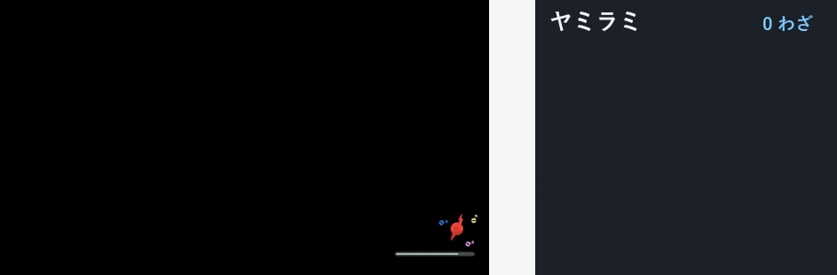

# ch-data-collector

ポケモンチャンピオンズの「覚える技一覧」の録画から、各ポケモンが覚える技を自動でデータ化するツールです。



## 収集データ

収集した覚える技のデータは、別リポジトリ [pokemon-champions-data](https://github.com/ycookiey/pokemon-champions-data)（CC0）で公開しています。[ステータスページ](https://ycookiey.github.io/pokemon-champions-data/) で収録状況と未収録のポケモンを確認できます。

## 録画

- 撮影元: Switch本体キャプチャ / キャプチャボード経由PC録画（**クリーンな16:9フルフレーム**前提。黒帯・クロップ・スマホでのTV撮影は不可）
- 解像度非依存（720p / 1080p / 480p 等）、複数ファイル渡し可

撮影手順は [docs/recording-guide.md](docs/recording-guide.md) を参照してください。

## 使い方

```bash
uv sync
uv run ch-data-collector video.mp4 -o learnset.json --fps 60
```

`--fps` には、連続スクロールで各行を取りこぼさないよう動画の実fps（通常 30 / 60）を指定してください。出力は `{ pokemonName: [moveName, ...] }` のJSONで、ポケモン名は公開データの表記へ正規化されます。その他のオプションは `--help` を参照してください。

得られた JSON は、公開データリポジトリの [「技データの提出」issue](https://github.com/ycookiey/pokemon-champions-data/issues/new?template=collect.yml) に貼り付けて送ると、自動で検証されデータ追加の Pull Request が作成されます。

## ライセンス

コードおよび構造化データは [MIT License](LICENSE) です。技マスタ `data/master/moves.json` は [towakey/pokedex](https://github.com/towakey/pokedex)（MIT）に由来します。ポケモンの著作物（技名・画面等）は (株) ポケモン / 任天堂 / ゲームフリーク / クリーチャーズ に帰属し、本リポジトリはその権利を主張しません。
