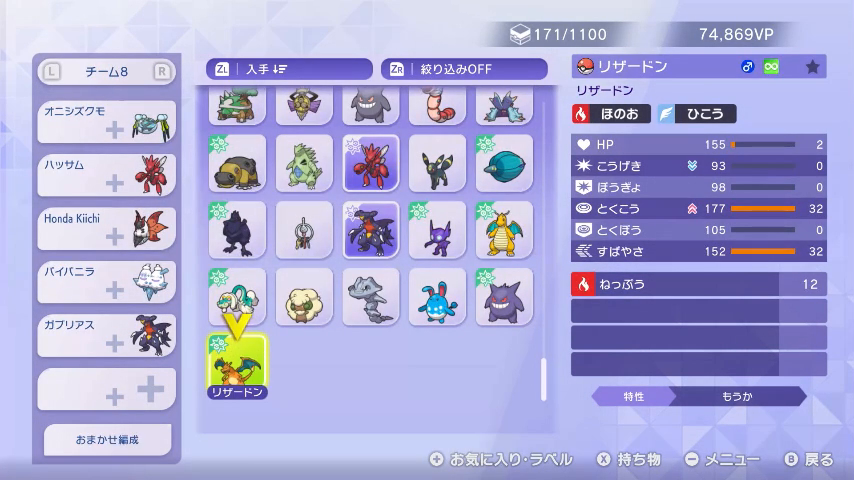
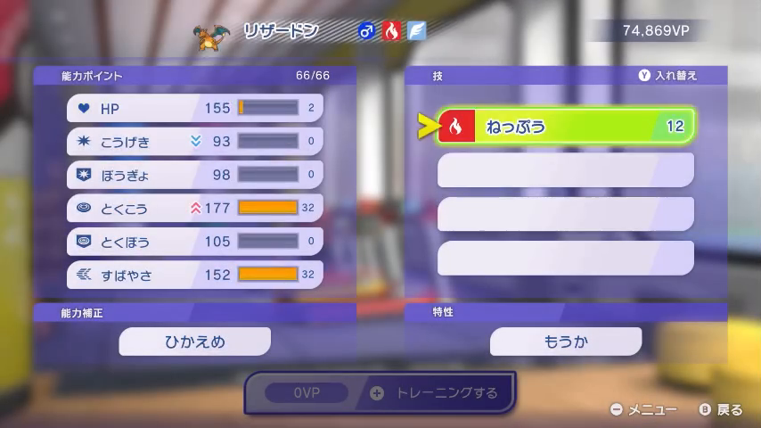
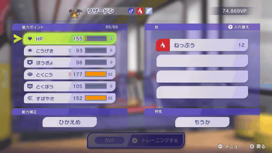

# 技データ録画手順書

ポケモンチャンピオンズにて各ポケモンが覚える技を動画から収集するため、以下の撮影手順にご協力ください。

## 手順

**① ボックスで対象ポケモンを選びます。**

右パネルに出る**種族名**でどのポケモンかを判別します。ニックネームを付けていても種族名で判別できます。

ポケモンを選ぶと能力ポイント画面が開きます。ここから技一覧画面へ進んでください。

**② 技一覧画面を開き、スクロールして一周します。**

技一覧は循環します。**最初に表示された技が再び出てくるまで**スクロール（一周）してください。開始位置は自由です。**左右キー長押しのページ送りが速くておすすめ**です（上下キーでも可）。

**③ ボックス画面に戻って次のポケモンを選び、①→②を繰り返します。**

1本の動画で複数のポケモンを録画いただいても問題ありません。

## NG例

- ボックスで選ぶ画面（種族名が映る）を飛ばす
- 最初の技が再び出てくる前にスクロールを止める（全技が映らない）
- テレビ画面をスマホで撮る
- 画面の一部だけを拡大・切り抜く

## 提出方法

未定

---
ゲーム本体・技名・画面等の著作物は (株) ポケモン / 任天堂 / ゲームフリーク / クリーチャーズ に帰属。動画はポケモンのデータ収集の目的にのみ使用します。
